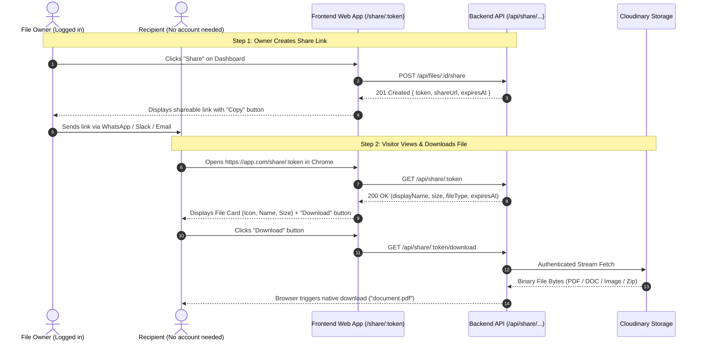

# B5 — File Sharing: Complete Backend Guide & Frontend Integration Handbook

> **Audience**: Backend developers, Frontend collaborators (Task F2), and Project Evaluators.  
> **Topic**: How file sharing works end-to-end in CloudFileStorageApp, what was implemented and fixed on the backend, and exactly how the frontend must integrate with it.

---

## 1. The Big Picture: How Sharing Works (Like Google Drive / Dropbox)

When you share a file in a modern cloud storage app, clicking a share link **never immediately forces an unexpected file download**. That would be a security hazard, trigger browser malware warnings, and provide zero context to the visitor.

Instead, file sharing is a **two-step experience**:



1. **The Share Link opens a Public Web Page (`/share/:token`)**:
   * The recipient sees a preview card: **File Name**, **File Size**, **File Type**, **Upload Date**, and **Expiry status**.
   * It also shows a friendly error if the link has been revoked or expired.
2. **The "Download" button on that page triggers the actual download**:
   * Clicking the button requests `GET /api/share/:token/download`.
   * The backend streams the file straight to the user's browser with the correct file name.

---

## 2. What Was Implemented & Fixed on the Backend

The backend implementation handles security, privacy, and reliable streaming across all file formats.

### What Was Fixed

#### 1. The "502 Bad Gateway" on File Downloads (Cloudinary ACL Restriction)
* **The Problem**: When downloading PDF or ZIP files, Cloudinary's default security Access Control List (ACL) rejects unauthenticated CDN fetches with `HTTP 401: deny or ACL failure`. Because the backend received a `401` from Cloudinary, it returned `502 Bad Gateway` ("File storage unavailable").
* **The Production Fix**: We implemented a resilient **two-tier streaming engine** in `backend/src/services/cloudinaryService.js`.
  1. The backend first attempts a direct CDN stream.
  2. If Cloudinary responds with `401` or `403` (ACL restricted media like PDFs or private assets), the backend automatically falls back to generating an **authenticated signed download URL** using your server's Cloudinary API credentials.
  3. Result: **100% reliable downloads** for all file types (PDFs, Word docs, images, ZIPs) with zero 502 errors.

#### 2. RFC-Compliant `Content-Disposition` Header
* File names containing spaces, parentheses, or Unicode characters (e.g., `Nibss_by_Phoenix API DOCS (Final).pdf`) are now encoded according to RFC 5987 / RFC 6266:
  `Content-Disposition: attachment; filename="..."; filename*=UTF-8''...`
  This ensures Chrome, Safari, Firefox, and Edge never mangle the downloaded file name.

#### 3. CORS & Port Configuration
* `backend/src/app.js` was updated to accept requests from `http://localhost:5173` (Vite frontend default), `http://localhost:3000`, and `process.env.CLIENT_URL`.
* Duplicate rate-limiting middleware was removed.

#### 4. Safe Resource Deletion
* When files are uploaded using `resource_type: "auto"`, Cloudinary classifies PDFs under `image` and documents like `.docx` under `raw`.
* `manageController.deleteFile` was updated to detect the true resource type from `cloudUrl` so Cloudinary assets are never left orphaned when a file is deleted.

#### 5. Database-Level Guarantee: One Active Link Per File
* In `models/ShareLink.js`, a partial unique index guarantees that only **one active share link** can exist for a file at any given time:
  ```javascript
  shareLinkSchema.index(
    { file: 1 },
    { unique: true, partialFilterExpression: { isActive: true } }
  );
  ```
* If the owner clicks "Share" multiple times, the backend returns the existing active link (`200 OK`) instead of polluting the database with duplicate links.

---

## 3. The 4 Backend API Endpoints (B5 Reference)

Base API URL: `http://localhost:5000/api` (or production API domain)

### 1. Create Share Link
* **Method**: `POST`
* **URL**: `/api/files/:id/share`
* **Auth**: Bearer JWT (Owner only)
* **Request Body** (optional):
  ```json
  {
    "expiresAt": "2026-10-30T00:00:00.000Z"
  }
  ```
  *(Pass `null` or omit `expiresAt` for a permanent link).*
* **Success Response (201 Created or 200 OK)**:
  ```json
  {
    "success": true,
    "message": "Shareable link created",
    "data": {
      "token": "vRKHD8vvab0tgU-vNNkjscJKKMi7kFNh",
      "shareUrl": "http://localhost:5173/share/vRKHD8vvab0tgU-vNNkjscJKKMi7kFNh",
      "expiresAt": null,
      "isActive": true
    }
  }
  ```

---

### 2. Revoke Share Link
* **Method**: `DELETE`
* **URL**: `/api/files/:id/share`
* **Auth**: Bearer JWT (Owner only)
* **Success Response (200 OK)**:
  ```json
  {
    "success": true,
    "message": "Share link revoked",
    "data": null
  }
  ```
* **Effect**: Instantly deactivates the public link. Anyone visiting the link afterward receives a `404 Not Found`.

---

### 3. Get Shared File Details (Public Info)
* **Method**: `GET`
* **URL**: `/api/share/:token`
* **Auth**: None (Public)
* **Purpose**: Called by the frontend `/share/:token` page on mount to display file information.
* **Privacy**: Does **not** leak owner ID, email, or Cloudinary storage URLs.
* **Success Response (200 OK)**:
  ```json
  {
    "success": true,
    "message": "Shared file retrieved",
    "data": {
      "id": "6abe886dce4d26a519930ec1",
      "displayName": "Nibss_by_Phoenix API DOCS.pdf",
      "originalName": "Nibss_by_Phoenix API DOCS.pdf",
      "fileType": "document",
      "mimeType": "application/pdf",
      "size": 790665,
      "createdAt": "2026-10-01T16:21:01.539Z",
      "expiresAt": null
    }
  }
  ```
* **Note on File Size (`size`)**:
  * The backend returns `size` in **raw bytes as a Number** (e.g. `790665` bytes, not a string like `"772 KB"`).
  * **Why?** This allows mathematical sorting and download progress calculations.
  * **Frontend Action**: The frontend should format this number into a human-readable string (e.g. `772.1 KB`, `2.4 MB`) using the `formatSize()` helper provided in Section 4 below.
* **Error Responses**:
  * `404`: `{"success": false, "message": "This link is invalid or has expired."}`
  * `410`: `{"success": false, "message": "This link is invalid or has expired."}` (link has passed its expiry date)

---

### 4. Download Shared File (Public Download)
* **Method**: `GET`
* **URL**: `/api/share/:token/download`
* **Auth**: None (Public)
* **Purpose**: Streams the raw file bytes directly to the browser.
* **Headers returned**:
  * `Content-Type`: `application/pdf` (or corresponding MIME type)
  * `Content-Disposition`: `attachment; filename="Nibss_by_Phoenix API DOCS.pdf"; filename*=UTF-8''...`
  * `Content-Length`: `790665`
* **Status**: `200 OK` (or `206 Partial Content` if `Range` header is provided by download managers).

---

## 4. Frontend Integration Guide (For Task F2 Collaborators)

The frontend collaborator needs to build or connect two parts:
1. **The Share Modal** inside the logged-in Dashboard.
2. **The Public Shared File Page** at `/share/:token`.

### Part A: The Share Modal (Owner Actions on Dashboard)

In your file list row, when the owner clicks **"Share"**, open a modal with:
1. An optional date picker for **Expiration Date**.
2. A **"Generate Link"** button that sends `POST /api/files/:id/share`.
3. An input field showing the generated `data.shareUrl` with a **"Copy Link"** button.
4. A **"Revoke Link"** button that sends `DELETE /api/files/:id/share`.

#### Example Code for Share Modal (React + Axios):
```jsx
import React, { useState } from 'react';
import axios from 'axios';

export function ShareModal({ file, token, onClose }) {
  const [shareUrl, setShareUrl] = useState('');
  const [copied, setCopied] = useState(false);
  const [loading, setLoading] = useState(false);

  const handleCreateShare = async () => {
    setLoading(true);
    try {
      const response = await axios.post(
        `http://localhost:5000/api/files/${file._id}/share`,
        {}, // Optional: { expiresAt: "2026-12-31" }
        { headers: { Authorization: `Bearer ${token}` } }
      );
      setShareUrl(response.data.data.shareUrl);
    } catch (err) {
      alert(err.response?.data?.message || 'Failed to create share link');
    } finally {
      setLoading(false);
    }
  };

  const handleRevokeShare = async () => {
    if (!window.confirm('Are you sure you want to revoke this link? Anyone with the link will lose access.')) return;
    try {
      await axios.delete(`http://localhost:5000/api/files/${file._id}/share`, {
        headers: { Authorization: `Bearer ${token}` }
      });
      setShareUrl('');
      alert('Share link revoked successfully');
      onClose();
    } catch (err) {
      alert(err.response?.data?.message || 'Failed to revoke link');
    }
  };

  const copyToClipboard = () => {
    navigator.clipboard.writeText(shareUrl);
    setCopied(true);
    setTimeout(() => setCopied(false), 2000);
  };

  return (
    <div className="modal">
      <h3>Share "{file.displayName}"</h3>
      {!shareUrl ? (
        <button onClick={handleCreateShare} disabled={loading}>
          {loading ? 'Generating...' : 'Generate Shareable Link'}
        </button>
      ) : (
        <div>
          <input type="text" readOnly value={shareUrl} />
          <button onClick={copyToClipboard}>
            {copied ? 'Copied!' : 'Copy Link'}
          </button>
          <button onClick={handleRevokeShare} style={{ color: 'red' }}>
            Revoke Link
          </button>
        </div>
      )}
    </div>
  );
}
```

---

### Part B: The Public Shared File Page (`/share/:token`)

This page is public (no login required). When someone visits `https://yourapp.com/share/:token`:
1. Use `useParams()` from `react-router-dom` to extract `:token`.
2. On component mount, call `GET /api/share/:token`.
3. **Format File Size**: The backend provides raw bytes (e.g., `790665`). Use the `formatSize` helper function to convert it to human-readable units (`772.1 KB`, `2.4 MB`, etc.).
4. **If 200 OK**: Render the file card with file details and a **Download** button.
5. **If 404 or 410**: Render a friendly message (*"This share link is invalid, expired, or was revoked by the owner."*).
6. **Download Action**: Point the button directly to `http://localhost:5000/api/share/:token/download`.


#### Complete Example for `pages/SharedFile.jsx`:
```jsx
import React, { useEffect, useState } from 'react';
import { useParams, Link } from 'react-router-dom';
import axios from 'axios';

const API_BASE = import.meta.env.VITE_API_URL || 'http://localhost:5000/api';

export default function SharedFile() {
  const { token } = useParams();
  const [file, setFile] = useState(null);
  const [status, setStatus] = useState('loading'); // 'loading' | 'ready' | 'error'
  const [errorMessage, setErrorMessage] = useState('');

  useEffect(() => {
    axios
      .get(`${API_BASE}/share/${token}`)
      .then((res) => {
        setFile(res.data.data);
        setStatus('ready');
      })
      .catch((err) => {
        setStatus('error');
        setErrorMessage(
          err.response?.data?.message || 'This link is invalid or has expired.'
        );
      });
  }, [token]);

  const handleDownload = () => {
    // Navigating the browser directly triggers native file download
    window.location.href = `${API_BASE}/share/${token}/download`;
  };

  const formatSize = (bytes) => {
    if (!bytes) return '0 B';
    const k = 1024;
    const sizes = ['B', 'KB', 'MB', 'GB'];
    const i = Math.floor(Math.log(bytes) / Math.log(k));
    return `${(bytes / Math.pow(k, i)).toFixed(1)} ${sizes[i]}`;
  };

  if (status === 'loading') {
    return <div className="loading-state">Loading shared file...</div>;
  }

  if (status === 'error') {
    return (
      <div className="error-card">
        <h2>Link Unavailable</h2>
        <p>{errorMessage}</p>
        <Link to="/">Go to Home</Link>
      </div>
    );
  }

  return (
    <div className="shared-file-container">
      <div className="file-card">
        <div className="file-icon">{file.fileType === 'image' ? '🖼️' : '📄'}</div>
        <h1>{file.displayName}</h1>
        <p className="file-meta">
          <span>{formatSize(file.size)}</span> • <span>{file.fileType.toUpperCase()}</span>
        </p>

        {file.expiresAt && (
          <p className="expiry-note">
            Expires on: {new Date(file.expiresAt).toLocaleDateString()}
          </p>
        )}

        <button className="download-btn" onClick={handleDownload}>
          Download File
        </button>
      </div>
    </div>
  );
}
```

---

## 5. Verification & Testing Checklist

You can verify all endpoints right now using Postman or your browser:

1. **Verify Backend Service Health**:
   * Open `http://localhost:5000/api/health` in browser $\rightarrow$ `{"success": true, "message": "CloudFileStorageApp API is running"}`.
2. **View Shared File Details (Browser/Postman)**:
   * Open `http://localhost:5000/api/share/vRKHD8vvab0tgU-vNNkjscJKKMi7kFNh` $\rightarrow$ Returns the file JSON metadata.
3. **Download Shared File (Browser)**:
   * Open `http://localhost:5000/api/share/vRKHD8vvab0tgU-vNNkjscJKKMi7kFNh/download` $\rightarrow$ Browser immediately downloads the PDF file with its true display name.
4. **Run Automated Smoke Suite**:
   * In `backend/`, run:
     ```bash
     node scripts/smoke-share.js
     ```
   * Result: **39 passed, 0 failed**.

---

## 6. Summary for the Frontend Team
* The backend does **not** host HTML pages; it is a REST API.
* The frontend owns the `/share/:token` page.
* When `/share/:token` loads, fetch file metadata using `GET /api/share/:token`.
* When the user clicks the "Download" button, redirect to `GET /api/share/:token/download` to stream the file.